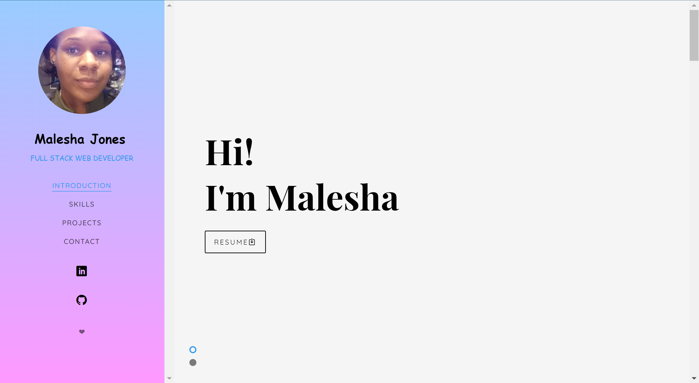
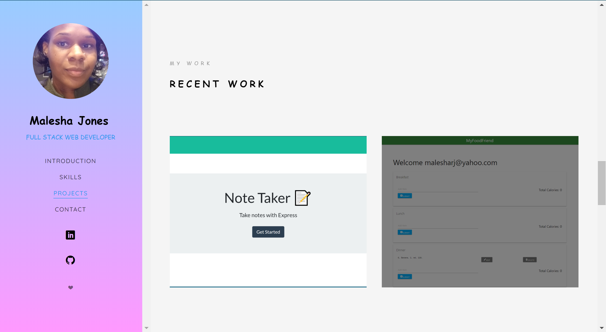

# My React Portfolio

[Repo: React Portfolio](https://github.com/Jones-M12/Jones-Portfolio.git)

[Deployed Site: React Portfolio](https://github.com/Jones-M12/Jones-Portfolio.git)

## Overview

Transition basic HTML portfolio and other materials to build toward being employer competitive by Creating a portfolio using React 

## User Story

As a Web Developer

I WANT to be able to showcase my skills.

SO THAT I can move forward in my career and land the career of my dreams.

#### Design

* Mobile-first design

* Simple layout that is easy to naviagte and seamless.

* Easy read font, good sizing and color.

## Contact Information

* GitHub: [Jones-M12](https://github.com/Jones-M12) 

* Email: malesharj@gmail.com 

* LinkedIn: [m-jones89](https://www.linkedin.com/in/m-jones8)

